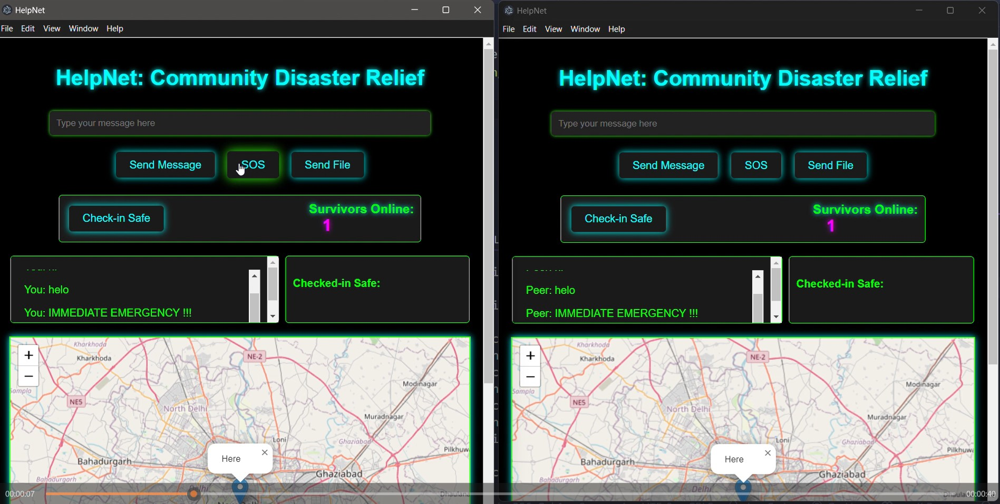

# HelpNet: A Peer-to-Peer Disaster Response Network

## 🌟 Introduction
In times of disaster, reliable communication and coordination are critical. **HelpNet** is a decentralized, peer-to-peer application designed to empower communities during emergencies. By facilitating real-time messaging, location sharing, SOS alerts, file sharing, and a safety check-in system, HelpNet ensures seamless collaboration even when traditional networks fail.

---

## 🔧 Features
- **Real-Time Messaging**: Connect with peers instantly.
- **SOS Alerts**: Broadcast urgent messages for immediate assistance.
- **Safety Check-Ins**: Confirm your safety and view a list of checked-in individuals.
- **File Sharing**: Exchange important documents, images, or instructions effortlessly.
- **Location Sharing**: View the real-time location of peers on a map for better coordination.
- **Offline-First Design**: Operates without reliance on centralized servers.

---

## 💡 Use Cases
- **Disaster Recovery**: Coordinate rescue operations and resource distribution.
- **Community Support**: Facilitate neighborhood safety checks during power outages or natural calamities.
- **Event Management**: Stay connected during large-scale outdoor events.

---

## 💻 Tech Stack
- **Frontend**: HTML, CSS, JavaScript
- **Backend**: [Hyperswarm](https://github.com/hyperswarm) for decentralized peer-to-peer networking.
- **Mapping**: Leaflet.js for location visualization.
- **Framework**: [Electron.js](https://www.electronjs.org/) for cross-platform desktop applications.

---

## 🎥 Demo Video
[](./HelpNetVid.mp4)  
Click on the thumbnail to view the demo in action!

---

## 🚀 Future Improvements
1. **Mobile App**: Extend HelpNet to iOS and Android platforms.
2. **Encryption**: Enhance data security with end-to-end encryption.
3. **Voice and Video Calls**: Enable richer communication.
4. **Offline Persistence**: Store data locally for extended offline usability.
5. **Theming**: Add more customizable themes to cater to diverse user preferences.

---

## 📖 How to Run Locally
1. **Clone the Repository:**
   ```bash
   git clone https://github.com/YourGitHubUsername/HelpNet.git
   cd HelpNet
   ```

2. **Install Dependencies:**
   Ensure you have Node.js installed, then run:
   ```bash
   npm install
   ```

3. **Run the Application:**
   ```bash
   npm start
   ```

4. **Package for Distribution:**
   To generate an executable for your platform:
   ```bash
   npm run package
   ```
   The packaged app will appear in the `dist` folder.

---

## 👨‍💻 Author
- **Name**: Prakhar Srivastava
- **GitHub**: [prakshark](https://github.com/prakshark)  
- **Email**: prakhar112358@gmail.com

---

## 🏁 Conclusion
HelpNet bridges the communication gap during crises, providing a reliable and intuitive platform for disaster response. With its decentralized architecture and rich feature set, HelpNet empowers individuals to collaborate effectively, ensuring safety and support when it matters most.
